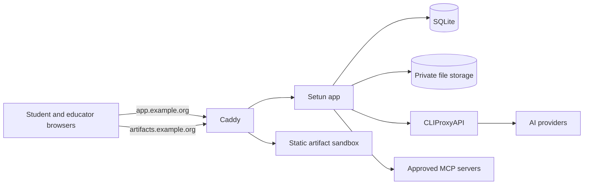

<p align="center">
  
</p>

<h1 align="center">Setun</h1>

<p align="center">
  <strong>A privacy-first AI learning environment for classrooms</strong>
</p>

<p align="center">
  <a href="https://github.com/edbpede/setun/actions/workflows/ci.yml"></a>
  <a href="https://github.com/edbpede/setun/blob/main/LICENSE"></a>
  
  
  
  
</p>

---

## What is Setun?

Setun is a self-hosted environment for teaching AI and *Teknologiforståelse*. Students use
pseudonymous access cards instead of accounts, email addresses, or real names. Educators control
which models, skills, tools, schedules, and spending limits each classroom receives.

The application combines streaming AI chat with a code artifact workspace, while keeping generated
code on a separate, tightly restricted origin. Model credentials stay behind an internal gateway and
never reach the browser or the Setun database.

The name comes from the 1958 Setun computer, built around balanced ternary. The mark stacks its three
states: minus, zero, and plus.

## Features

- **Pseudonymous student access** — issue printable access cards without collecting names, email
  addresses, or third-party identities.
- **Classroom controls** — manage rosters, weekly schedules, temporary locks, model allowlists,
  instructions, retention, and daily or per-student budgets.
- **Streaming AI chat** — run classroom-scoped conversations with attachments, search, cancellation,
  and model aliases chosen by the educator.
- **Live artifacts** — preview, edit, rerun, and version HTML, SVG, JSX, TSX, and Svelte creations in
  an isolated workspace.
- **Curated capabilities** — publish reusable skills and expose only approved MCP tools, with
  per-classroom controls for tools that require confirmation.
- **Image workflows** — support image attachments and model-generated images without exposing the
  underlying storage directory.
- **English and Danish** — complete localized interfaces, with a classroom default and per-student
  override.
- **Self-hosted operations** — SQLite persistence, automatic migrations, retention jobs, nightly
  snapshots, and a Compose deployment behind Caddy.

## Architecture



The application and artifact sandbox must use different hostnames. That origin boundary is part of
the security model: Caddy serves the sandbox as static files with a restrictive content security
policy, and generated code has no route back into the authenticated application. CLIProxyAPI is
reachable only from the app's internal network and has no published host port.

## Tech stack

| Layer | Technology |
| --- | --- |
| Runtime and package manager | [Bun](https://bun.com) 1.4+ |
| Application | [SvelteKit](https://svelte.dev/docs/kit) 2, Svelte 5, TypeScript |
| UI | UnoCSS, shadcn-svelte, bits-ui |
| Data | SQLite with Drizzle ORM |
| Validation and forms | Valibot and sveltekit-superforms |
| Localization | Paraglide JS |
| Model gateway | [CLIProxyAPI](https://github.com/router-for-me/CLIProxyAPI) |
| Production edge | Caddy and Docker Compose |
| Quality gates | svelte-check, Biome, Bun test, Vitest, Playwright |

## Quick start

For local development, install:

- [Bun](https://bun.com) 1.4 or newer
- Python 3.14 for the development suite
- [prek](https://prek.j178.dev) for repository hooks

Then run:

```sh
bun install
prek install
./scripts/devsuite start
```

The suite starts the application, sandbox, and a persistent development database, then prints the
student and educator URLs and credentials. Development secrets are generated per instance when they
are not present in the environment or `.env`; the suite never writes them to `.env`.

The default application is at `http://localhost:5173`, with educator login at
`http://localhost:5173/educator/login`. The sandbox runs separately on port `5174`. Pressing Ctrl-C
stops an attached stack while preserving its data.

Useful commands:

```sh
./scripts/devsuite status                 # show services, ports, and health
./scripts/devsuite logs app               # follow one service
./scripts/devsuite stop                   # stop and preserve the default instance
./scripts/devsuite start --ephemeral      # use a disposable database
./scripts/devsuite start --with-cpa       # include the model gateway; needs Docker
./scripts/devsuite start --production     # reproduce the Caddy deployment locally
./scripts/devsuite --help                 # all commands and options
```

Production mode serves `http://setun.localhost:8080` and
`http://sandbox.setun.localhost:8080`. It builds both applications, runs the adapter-node server
behind the repository's Caddy configuration, and uses Caddy's static file server for artifacts. TLS
is the only production behavior omitted.

To run the two development servers manually instead:

```sh
bun --bun run dev       # application on :5173
bun run dev:sandbox     # sandbox on :5174, in a second terminal
```

## First-time setup

### 1. Prepare the deployment

You need Docker with Compose, Bun 1.4+, and two DNS names pointing to the host: one for Setun and one
for the artifact sandbox.

```sh
bun install --frozen-lockfile
cp .env.example .env
cp cpa/config.example.yaml cpa/config.yaml
cp mcp.example.json mcp.json
```

Fill in `.env`, then configure the provider account in `cpa/config.yaml`. Two secrets deserve special
care:

- `SETUN_STUDENT_CODE_PEPPER` must be high-entropy and permanent. Changing it invalidates every
  existing student access code.
- `SETUN_CPA_LISTENER_KEY` must exactly match the value under `api-keys` in
  `cpa/config.yaml`.

`SETUN_APP_ORIGIN` and `SETUN_SANDBOX_ORIGIN` must be full public URLs on different hosts. Their
hostname-only counterparts configure Caddy. Leave both educator seed variables blank to use the
guided first-run setup.

MCP is optional. If the installation offers no tools, replace the example entry in `mcp.json` with
an empty `servers` object. Credentials are referenced there by environment-variable name; do not put
secret values in the JSON file.

### 2. Build and start

```sh
bun run build:sandbox
docker compose up -d --build
docker compose logs app
```

The sandbox build is explicit because Caddy serves `build-sandbox/` directly from the host. The app
itself is built into its container image.

### 3. Complete the wizard

On an unconfigured database, Setun writes a one-time setup token to the app log and redirects every
route to `/setup`. Open the application URL, enter the token, and follow the wizard to:

1. Create the educator account.
2. Verify the model gateway.
3. Add the first model alias.
4. Create a classroom.
5. Issue the first student access cards.

The token expires after 15 minutes; restarting the app issues a new one. If
`SETUN_EDUCATOR_SEED_USERNAME` and `SETUN_EDUCATOR_SEED_PASSWORD` are both set, Setun seeds that
account at boot and skips the wizard. Updating the seeded password and restarting is also the
recovery path for a forgotten educator password.

## Configuration notes

- **Provider credentials** belong to CLIProxyAPI, not Setun. Its management API, control panel,
  plugins, and public port are disabled by the supplied configuration.
- **MCP servers** are defined in the read-only `mcp.json`; the educator panel may enable configured
  servers and tools but cannot add endpoints.
- **Persistent data** lives in separate Compose volumes for the database, private storage, backups,
  provider authentication, and Caddy state.
- **TLS** is handled automatically by Caddy for publicly reachable hostnames. For a closed network,
  use Caddy's internal CA as described in the comments in `Caddyfile`.
- **Backups** contain a consistent SQLite snapshot plus private storage. Fourteen daily snapshots are
  retained by default; copy the backup volume off-host for disaster recovery.

## Development

Every build has two outputs:

- `build/` — the adapter-node application
- `build-sandbox/` — the static artifact host, runtimes, and compilers

Always use `bun run build`; running only the SvelteKit build leaves the artifact panel without the
files it needs. The development suite keeps each named instance under `.devsuite/instances/` with
its own database, logs, and production build outputs.

### Quality gates

CI runs five independent gates:

```sh
bun run check         # Svelte and TypeScript correctness
bunx biome ci         # formatting and linting
bun test              # server logic and rune modules
bunx vitest run       # component behavior in Chromium
bunx playwright test  # end-to-end flows
```

Install Chromium once with `bunx playwright install chromium` if it is not already available.

Test filenames select their runner:

| Scope | Filename | Runner |
| --- | --- | --- |
| Server logic and `.svelte.ts` rune modules | `*.test.ts` | Bun |
| Svelte components | `*.svelte.spec.ts` | Vitest Browser Mode |
| Other tests needing Vite resolution | `*.spec.ts` | Vitest server project |
| Real-server flows | `*.e2e.ts` | Playwright |

### Project conventions

- Add every user-facing message to both `messages/en.json` and `messages/da.json`.
- Styling uses UnoCSS, not Tailwind. Add shadcn-svelte components with
  `bunx shadcn-svelte add <component> --skip-preflight`; never run `init`.
- Use `bun run check` as the authority for Svelte templates. Biome does not fully understand Svelte
  markup, so never apply its unsafe fixes to a component.
- The design baseline is tweakcn's clean-slate theme, ported to bare oklch components in
  `uno.config.ts`.
- Install `prek` before committing. Hooks enforce Conventional Commits, protect `main`, and scan for
  secrets.

See [`AGENTS.md`](AGENTS.md) for the complete repository rules before contributing.

## License

Setun is licensed under the [GNU Affero General Public License v3.0](LICENSE).
